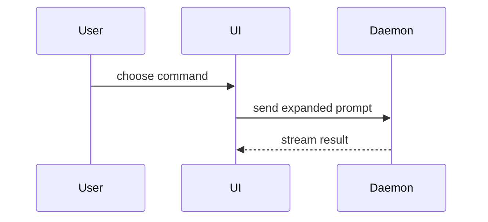

# show-me

Show the topic instead of describing it. If the user typed no topic, show
whatever the conversation is currently about. Before drafting prose beside a
figure, read `references/prose.md`; a new rule on writing or drawing is filed
in `references/`.

## The doctype

Name the doctype first, by the doctype test in
[doctype](references/doctype.md), and hold the result to that file. Where each
doctype is built and how it reaches the reader is
[delivery](references/delivery.md).

## The forms

A `view` in chat. Pick the smallest form that makes the point, place it next
to the short text it supports, and keep only the calls, files, props, states
and boundaries the current question needs. Use one form, sometimes several,
never all of them.

**Pseudocode** for logic or an algorithm:

```text
on(save)
  if content is unchanged
    return cached result
  write new content
```

**A call tree** for runtime control flow:

```text
submitForm
  createSession
    persistPrompt
    launchAgent
  navigateToSession
```

**A component tree** for UI structure, carrying the state and module
boundaries that matter:

```tsx
<SessionPage> (apps/web/src/routes/session.tsx)
  useSessionEvents()
  <SessionToolbar>
    <RunSkillButton> (packages/ui)
```

**A shallow file tree** for file responsibility or a broad refactor:

```text
src/
├── commands/       # parses user actions
├── sessions/       # owns session state
└── transport/      # sends API requests
```

**Mermaid** for component interaction, control flow, or data flow:



**A diff** when the point is what changes and the surrounding shape already
exists. The diff takes the shape of whichever form above fits the topic — a
file tree, a call tree, a component tree, pseudocode:

```diff
 src/
 ├── commands/
+│   └── show-me.ts       # expands the slash command
 ├── sessions/
-└── transport.ts
+└── transport/
+    ├── client.ts
+    └── stream.ts
```

**The whole block** when most of it is new, when omitted context would hide
ownership or order, or when the user needs a copyable target shape.

## The HTML page

For a `view` too dense for Mermaid — a visual UI, a layout, a state
comparison — and for every `dashboard` and `ui`: one page. Where it is
written and how it is delivered is [delivery](references/delivery.md); how it
is rendered to PNG and probed at 320 px is [to-png](references/to-png.md).

Topic: $ARGUMENTS
