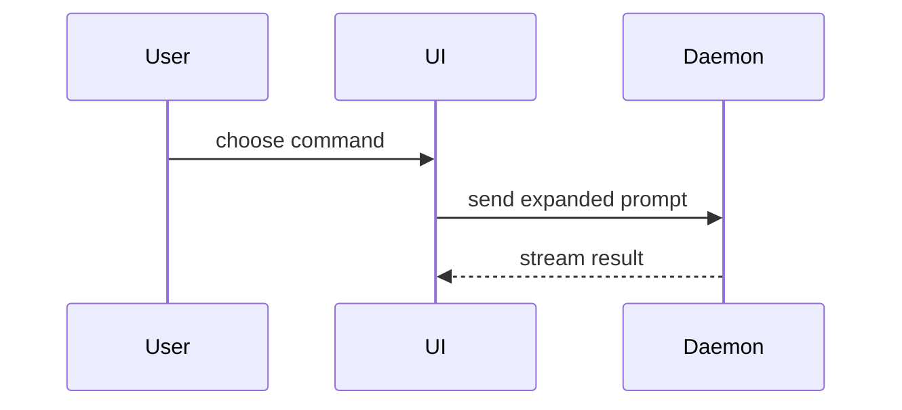

# show-me

Show the topic instead of describing it. Pick the smallest view that makes the
point, place it next to the short text it supports, and keep only the calls,
files, props, states and boundaries the current question needs. Use one form,
sometimes several, never all of them. If the user typed no topic, show whatever
the conversation is currently about.

## The forms

**Pseudocode** for logic or an algorithm:

```text
on(save)
  if content is unchanged
    return cached result
  write new content
```

**A call tree** for runtime control flow:

```text
submitForm
  createSession
    persistPrompt
    launchAgent
  navigateToSession
```

**A component tree** for UI structure, carrying the state and module
boundaries that matter:

```tsx
<SessionPage> (apps/web/src/routes/session.tsx)
  useSessionEvents()
  <SessionToolbar>
    <RunSkillButton> (packages/ui)
```

**A shallow file tree** for file responsibility or a broad refactor:

```text
src/
├── commands/       # parses user actions
├── sessions/       # owns session state
└── transport/      # sends API requests
```

**Mermaid** for component interaction, control flow, or data flow:



**A diff** when the point is what changes and the surrounding shape already
exists. The diff takes the shape of whichever form above fits the topic — a
file tree, a call tree, a component tree, pseudocode:

```diff
 src/
 ├── commands/
+│   └── show-me.ts       # expands the slash command
 ├── sessions/
-└── transport.ts
+└── transport/
+    ├── client.ts
+    └── stream.ts
```

**The whole block** when most of it is new, when omitted context would hide
ownership or order, or when the user needs a copyable target shape.

## The HTML page

For a visual UI, a layout, a state comparison, or a concept too dense for
Mermaid, write one self-contained HTML page to `/tmp/show-me-<topic-slug>.html`
— inline styles and inline SVG only, nothing fetched from the network, so it
opens with no connection. Match the product's colours, type, spacing and
components; use real labels and real data; lay out for desktop and phone.

Then deliver it both ways, and tell the user the one-sentence version in chat.

- **Desktop**: `open` on that path.
- **Phone**: an *image*, because that is what a chat surface renders.
  Screenshot the page with headless Chrome, trim it to its content height,
  split it into ~950-unit slices, and Read each PNG. Reading the `.html` back
  is not a delivery — it renders as source text. `references/to-png.md` is the
  recipe.

SendUserFile is not available in every harness, so never build the delivery on
it; check with ToolSearch before naming it.

Topic: $ARGUMENTS
